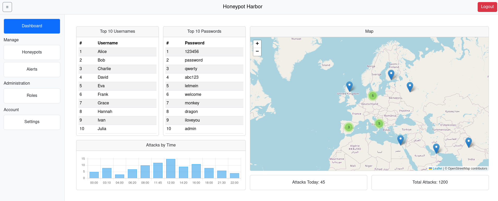

# 🍯 Honeypot Harbor ⚓

> **Honeypot Harbor** is a small honeypot platform built for a Distributed Systems course to explore high availability and scalability. The stack uses **Cowrie** honeypots (attack surface), **Filebeat → Logstash → Elasticsearch** for log pipeline and a **Spring Boot + Vue.js + PostgreSQL** web app for visualization and user management.



---

## Project goals

* Learn and demonstrate **high availability** and **scalability** concepts.
* Build an end-to-end **logging & SIEM-style** pipeline using beats, Logstash and Elasticsearch.
* Visualize attacker activity and allow role-based access to the data via a web UI.
* Get hands-on experience with **Spring Boot** (backend), **Vue.js** (frontend) and container networking (macvlan).

---

## Architecture 

```
.
├── attacker-net
│ ├── cowrie-etc # Cowrie configuration (cowrie.cfg)
│ └── docker-compose.yml # Starts 3 Cowrie containers on attacker-net
├── gateway
│ ├── docker-compose.yml # Filebeat/gateway compose
│ └── filebeat.yml # Filebeat config to ship logs to Logstash
├── internal-net
│ ├── backend # Spring Boot backend 
│ ├── frontend # Vue.js frontend 
│ ├── logstash # Logstash pipeline
│ ├── postgres # Backend DB init SQL
│ └── docker-compose.yml # Internal network compose 
├── docs # Documentation
├── startup.sh # Creates macvlan networks + starts system
├── shutdown.sh # Tears down networks and containers
└── test # Test helpers & load scripts
```

- **attacker-net** (macvlan) — hosts the 3 Cowrie containers. Each Cowrie writes session logs into its logs/cowrie[n] folder 

- **gateway** — runs Filebeat which reads the Cowrie log directories and forwards events to Logstash across the internal-net. The gateway is the bridge between the attacker-facing network and the internal monitoring network.

- **internal-net** (macvlan) — contains 3 Logstash instances (with GeoIP enrichment), Elasticsearch (log storage), the Spring Boot backend (API, auth) and the Vue.js frontend (UI). Postgres holds backend user data and NGINX is used for Loadbalancing betweens 3 frontend and 3 backend instances.

- startup.sh / shutdown.sh — manage macvlan creation and container orchestration. The docker-compose.yml files in each folder are used to define and run the services on their respective networks.

---

## Components

- **Cowrie** — SSH/Telnet honeypots (3 instances)
- **Filebeat** — ships honeypot logs
- **Gateway** — aggregates Filebeat inputs and forwards to Logstash
- **Logstash** — parses/enriches logs (GeoIP) and pushes to Elasticsearch
- **NGINX** — load balancing and reverse proxy for backend/frontend
- **PostgreSQL** — stores user and role administration data, (also used for JWT tokens)
- **Elasticsearch** — stores logs and provides search/analytics
- **Spring Boot backend** — API, auth, role management (3 instances)
- **Vue.js frontend** — dashboards, honeypot/alerts pages, auth UI (3 instances)

---

## Quick setup (Linux only)

> WSL and non-Linux hosts are not supported because the `startup.sh` script creates virtual/macvlan interfaces that require a native Linux kernel.

1. Clone the repository

```bash
git clone https://github.com/schl3sch/HoneypotHarbor.git
cd HoneypotHarbor
```

2. Initialize env files, there is one in the [internal-net](./internal-net/) directory called "internal.env" used for Docker Compose, and the other one is in [internal-net/frontend](./internal-net/frontend/) named ".env" used for building the Vue.js frontend container.

Templates: [internal.env](./internal-net/internal.env.template), [.env](./internal-net/frontend/.env.template)

3. Add a GeoIP database in the [geoip](./internal-net/logstash/geoip) directory. HoneypotHarbor was tested with MaxMind's GeoLite 2 City database, which can be downloaded for free on their [website](https://dev.maxmind.com/geoip/geolite2-free-geolocation-data/) after creating an account.

4. Run the startup script (requires `sudo` for creating shim networks + virtual ethernet)
> There are two startup scripts:
> - startup.sh → use when you have a physical Network Interface Card.
> - veth-startup.sh → use when no suitable NIC is available (creates a virtual veth pair).

```bash
sudo ./startup.sh eth0     # for hosts with NIC (please specify your interface as argument)
sudo ./veth-startup.sh   # for hosts without a usable NIC
```

This script will:

* Create the two macvlan networks, a virtual ethernet and 2 shim networks.
* setup the directorys for honeypot logs
* Start containers for the honeypots (Cowrie), gateway, Logstash and the web services.

5. Interact with the honeypots (example)

```
# connect to the first Cowrie honeypot
ssh -p 2222 username@192.168.1.131
```

6. Open the web UI

* Frontend: `http://192.168.1.112`
* Initial admin account:

  * **username:** `admin`
  * **password:** `admin`

> On first login you will be prompted to change the password.

7. Shutdown (use the matching script):
```bash
sudo ./shutdown.sh        # if started with startup.sh
sudo ./veth-shutdown.sh   # if started with veth-startup.sh
```

---

## Dummy Logs
HoneypotHarbor provides dummy logs to fill the Elasticsearch database with documents. To do that, execute the [write-test-logs-elastic.sh](./test/write-test-logs-elastic.sh) script.

---

## Users & Roles

There are currently 3 predefined roles. New registrations are assigned the **User** role by default.

* **Admin** — full access, can assign roles in the administration panel.
* **Analyst** — access to Honeypots and Alerts pages (read/operate on observed data).
* **User** — dashboard-only access (general metrics & summaries).

To grant Analyst or Admin rights, an existing Admin must assign the role via the Admin panel.

---


### Example IPs

* Cowrie honeypots: `192.168.1.131`, `192.168.1.132`, `192.168.1.133`
* Web UI: `http://192.168.1.112`

### Disclaimer

This "small project" spins up to 16 containers at once (honeypots, backends, frontends, databases, proxie, …). Depending on your laptop’s mood, this could lead to:

- Fans sounding like a jet engine
- Docker being slower than expected
- Occasional laptop crashes if resources are low
